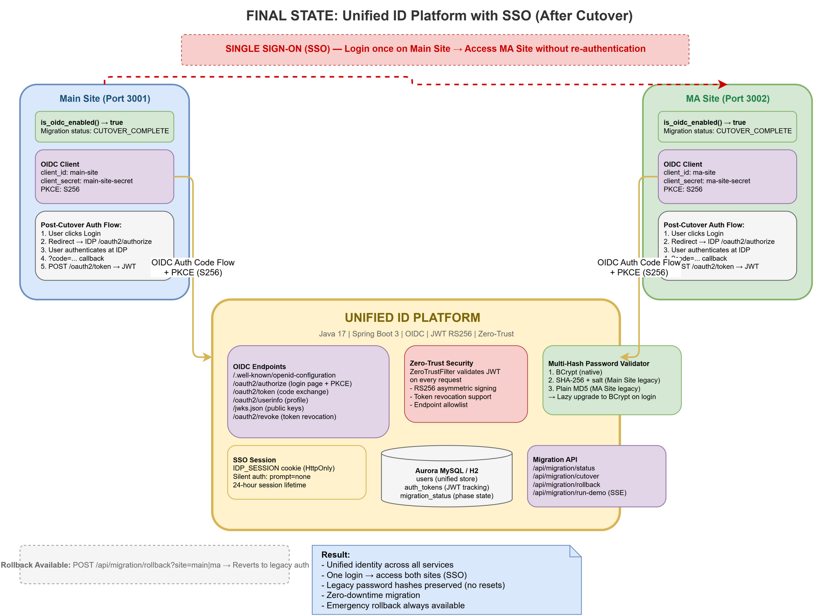
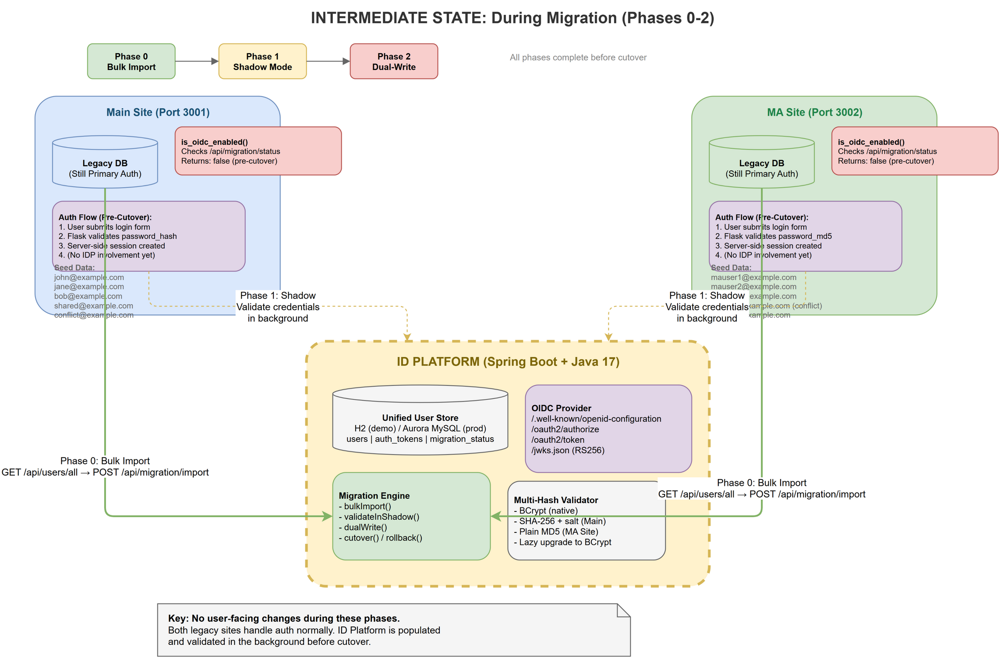

# ID Platform Migration Plan

This document is the interview-facing answer for the RAKSUL ID Platform work sample. It is written as a direct response to the prompt and uses the implementation in this repository as a demo artifact to illustrate the proposed migration approach.

## Assumptions

The prompt leaves several implementation details open, so the proposal makes these assumptions:

1. The main site and MA site can each be modified to integrate with an external Identity Provider.
2. Both legacy systems can expose member data for one-time import and ongoing reconciliation.
3. Existing password hashes from both sites are available to the ID platform during migration.
4. Email is the primary user identifier across services.
5. Some overlapping users between the two sites may require manual review during M&A reconciliation.
6. A phased migration with feature flags or routing switches is acceptable.
7. Zero downtime is preferred, but a limited maintenance window may be used only if rollback, reconciliation, or emergency correction requires it.

## Objective

The goal is to consolidate authentication and member management for the main site and MA site into a single ID platform while preserving business continuity for the main site, avoiding forced password resets, and enabling SSO across services.

The design centers on three outcomes:

- one identity layer for multiple services
- minimal user friction during migration
- safe rollback with low operational risk

## Architecture

### Final architecture

The final architecture places the ID platform in the center as the system of record for authentication, profile management, and SSO. Both business services become relying parties and delegate login to the ID platform over OIDC Authorization Code Flow with PKCE.

Reference diagram: `architecture/final-state.png`

In the final state:

- users authenticate through the ID platform
- the main site and MA site trust ID platform-issued tokens
- SSO is enabled through the shared ID platform session
- profile changes are handled centrally
- future services can be onboarded by registering as additional OIDC clients through `POST /oauth2/register`, without restarting the platform

### Intermediate architecture

During migration, both legacy services continue to authenticate users locally while the ID platform is populated and validated in parallel. This reduces cutover risk and makes rollback operationally simple.

Reference diagram: `architecture/intermediate-state.png`

In the intermediate state:

- legacy authentication remains active
- users are imported into the ID platform
- shadow validation compares expected authentication outcomes
- new writes are synchronized so the ID platform does not fall behind
- cutover can happen one site at a time

## Migration approach

### Phase 0: Build the ID platform foundation and bulk import users

The first step is to build the core ID platform capabilities: user store, credential validation, token issuance, profile APIs, and OIDC endpoints. Once the platform is ready, users from both legacy sites are imported into the new identity store.

The import preserves legacy credential formats instead of forcing a password reset. For this case, the platform must support:

- main site legacy hashes
- MA site legacy hashes
- the platform’s native strong hash format for newly created or upgraded credentials

This phase should also detect M&A overlap cases:

- same email and clearly same account: merge candidates
- same email but ambiguous ownership: manual review required

### Phase 1: Shadow validation

In shadow mode, users still sign in through the legacy services, but the team validates in the background whether the ID platform would have accepted the same credentials. The purpose is to prove parity before any traffic is switched.

This phase reduces the probability of a bad cutover because the team can identify:

- hash handling issues
- mismatched imported records
- merge errors for overlapping accounts
- unexpected edge cases in legacy data

### Phase 2: Dual-write for new and changed data

Once import quality is stable, registration and profile changes should be written to both the legacy systems and the ID platform. This prevents the new platform from becoming stale during the observation window.

This is especially important for rollback safety. If a user changes their email or password shortly before or after cutover, the legacy systems must not be missing that change if traffic is reverted.

### Phase 3: Site-by-site cutover

Cutover should happen in two steps:

1. MA site first
2. main site second

This order reduces business risk. The MA site has a much smaller user base and lower business impact than the main site, so it is the right place to validate production cutover behavior, SSO behavior, support procedures, and rollback timing.

Once a site is cut over:

- login moves from the local auth flow to the ID platform
- the site becomes an OIDC client
- SSO becomes available across participating services

### Phase 4: Rollback readiness and controlled decommissioning

Rollback should remain possible until the platform has proven stable over a sufficient observation period. Even after cutover, the legacy systems should not be retired immediately.

The team should only decommission legacy authentication after:

- login success rates are stable
- error rates remain within target
- support volume is normal
- rollback drills have been completed
- password and profile reconciliation logic has been verified

## Necessary modifications

### ID platform

The ID platform needs to provide these functions:

- centralized user authentication
- user profile management
- token issuance and validation
- OIDC discovery, authorization, token, and userinfo endpoints
- dynamic OIDC client registration for onboarding additional services
- SSO session handling
- migration status control for phased rollout
- import, validation, and reconciliation support

It must also support legacy password verification so users are not forced into a password reset during migration.

### Main site

The main site should be modified to:

- keep current login working before cutover
- support a cutover switch to external login through the ID platform
- add OIDC client behavior, including redirect and callback handling
- stop owning authentication logic after migration
- continue to own business functions such as orders, catalog, and service-specific UI

Because the main site is revenue-critical, these changes should be as isolated as possible from core commerce functions.

### MA site

The MA site requires similar changes:

- preserve current login before cutover
- integrate with the ID platform as an OIDC client
- move user authentication responsibility out of the local application
- retain service-specific business logic locally

This site is also the best first candidate for production cutover because it is smaller and lower risk.

### Data and migration operations

The migration layer needs:

- one-time import support
- overlap and conflict detection
- reconciliation reporting
- dual-write support for profile changes
- rollback procedures that keep user state understandable

## Password migration strategy

The main business constraint is to avoid forcing existing users, especially the 3 million main-site users, to reset their passwords. The recommended approach is lazy credential upgrade.

That means:

1. import existing credential hashes as-is
2. validate credentials using the legacy algorithm at login time
3. after successful login, replace the stored credential with the platform’s stronger hash format

This satisfies the user-experience constraint while still improving security over time.

## SSO design

SSO is enabled by routing both services to the same ID platform session. After the user authenticates once, the second service can request authorization from the ID platform and complete login without asking for credentials again.

This improves customer experience immediately and creates the right foundation for future SaaS launches or post-M&A service integration.

## Rollback strategy

Rollback must be treated as a first-class design requirement, not an afterthought. The safest rollback model is to keep the legacy login path available until the new platform has proven stable in production.

The rollback design should include:

1. per-site cutover switches so traffic can be reverted independently
2. continued synchronization of critical profile changes during the migration window
3. verification steps for login success after rollback
4. clear support playbooks for users whose identity state changed during the cutover period

The prompt specifically highlights password changes as a rollback risk. To handle that safely, the migration plan should ensure that credential changes made close to or during cutover can still be understood and reconciled if the site is reverted.

## Downtime strategy

The preferred migration path is no-downtime cutover through phased rollout and routing changes. A short maintenance window should remain available only as a contingency for emergency reconciliation, conflict resolution, or a controlled rollback.

This balances operational safety with the main-site revenue constraint.

## Risks and mitigations

### Overlapping accounts after M&A

The same user may exist in both systems with the same email but different account history. Automatic merging should be conservative. Ambiguous matches should be flagged for manual review instead of risking silent account corruption.

### Legacy password formats

Different credential formats increase migration risk. This is why shadow validation is essential before any production cutover.

### Revenue impact during main-site cutover

The main site should not be the first production target. Running MA-site cutover first creates operational learning with lower business risk.

### Rollback confusion

If users change their password or profile details around cutover time, rollback can become confusing unless changes are synchronized and support procedures are explicit. Dual-write and reconciliation reduce this risk.

## Why this plan fits the business goal

This plan gives the company a reusable identity foundation instead of solving the M&A case as a one-off integration. Once the ID platform is established:

- multiple services can share one customer identity
- customer data can be managed more consistently
- new SaaS services can launch faster
- future M&A integrations become easier

## Scope of the demo in this repository

The repository demonstrates the target direction of the plan with:

- final and intermediate architecture diagrams
- an ID platform service with OIDC-oriented flows
- legacy site demos
- migration phase modeling
- SSO-oriented cutover behavior

It should be read as a working demonstration of the proposed migration approach, not as a claim that every production hardening concern is fully implemented. Production rollout would still require stronger operational controls, observability, security hardening, and full reconciliation guarantees.

## Summary

The recommended migration plan is a phased move from two standalone authentication systems to a centralized ID platform with OIDC-based SSO. The plan minimizes business risk by importing users first, validating behavior in shadow mode, synchronizing changes during transition, cutting over the MA site before the main site, and preserving rollback capability until stability is proven.

This approach best satisfies the prompt’s constraints:

- no forced password reset for existing users
- low-risk migration for the revenue-critical main site
- safe, staged cutover
- practical rollback design
- strong long-term value as a reusable company-wide identity platform
