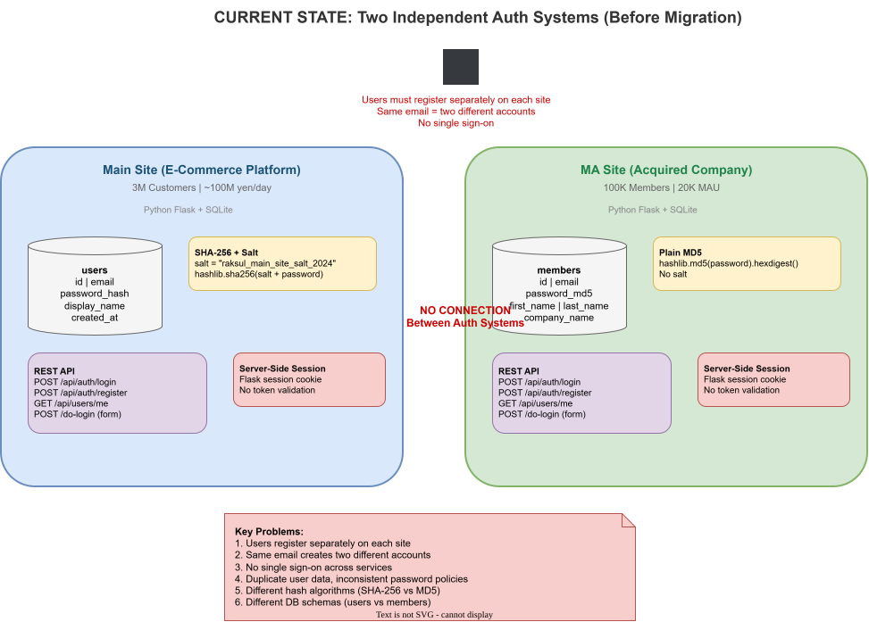
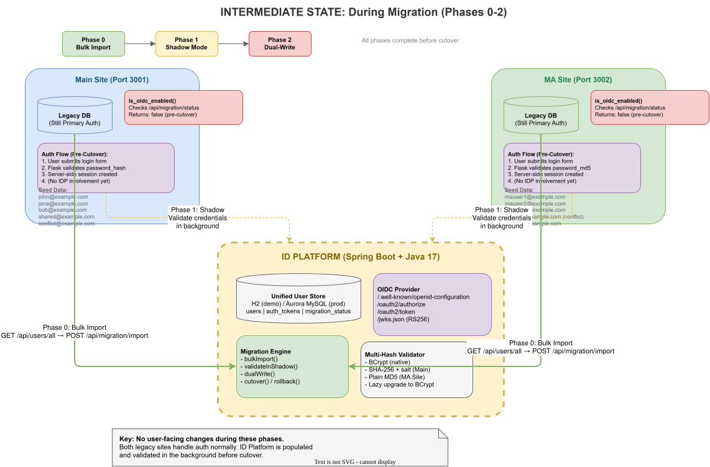
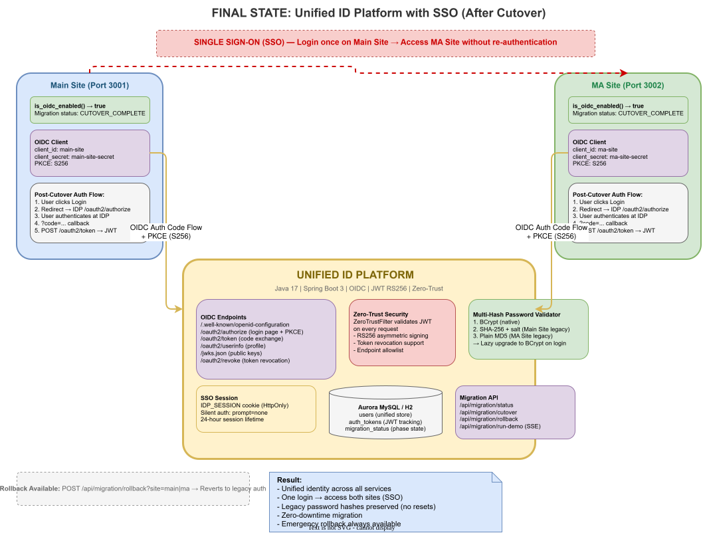

# Raksul ID Platform — Unified Identity Migration Demo

A working demonstration of migrating two independent legacy authentication systems into a single Identity Provider (IdP) using **Java Spring Boot** with full **OpenID Connect (OIDC)** support.

## Business Scenario

| | Main Site | MA Site (Acquired) |
|---|---|---|
| **Type** | E-commerce platform | Acquired company platform |
| **Users** | ~3M customers | ~100K members |
| **Password Hash** | SHA-256 + salt | Plain MD5 |
| **DB Schema** | `password_hash` column | `password_md5` column |

**Goal:** Unify both auth systems into a single IdP with SSO, zero downtime, and no forced password resets.

---

## Architecture

```
┌─────────────────────────────────────────────────────────┐
│                    Users / Browsers                      │
└───────────┬──────────────────┬──────────────────────────┘
            │                  │
            ▼                  ▼
┌───────────────────┐  ┌──────────────────────────────────┐
│   ID Platform     │  │        Dashboard UI               │
│   (Port 3000)     │◄─┤  Migration phases + SSE streaming │
│                   │  └──────────────────────────────────┘
│  ┌─────────────┐  │
│  │ OIDC Engine │  │         ┌──────────────────────┐
│  │ RS256 JWT   │  │◄────────│  Legacy Main Site    │
│  │ PKCE        │  │  OIDC   │  (Port 3001)         │
│  └─────────────┘  │  Fed    │  Python Flask/SQLite │
│  ┌─────────────┐  │         │  SHA-256+salt        │
│  │ Migration   │  │         └──────────────────────┘
│  │ Engine      │  │
│  │ Import      │  │         ┌──────────────────────┐
│  │ Shadow      │  │◄────────│  Legacy MA Site      │
│  │ Dual-Write  │  │  OIDC   │  (Port 3002)         │
│  │ Cutover     │  │  Fed    │  Python Flask/SQLite │
│  │ Rollback    │  │         │  Plain MD5            │
│  └─────────────┘  │         └──────────────────────┘
└───────────────────┘
         │
         ▼
┌───────────────────┐
│  H2 Database      │
│  (Aurora MySQL    │
│   in production)  │
└───────────────────┘
```

---

## Project Structure

```
raksul-id-platform-demo/
├── id-platform/                          # Java 17 / Spring Boot 3 IdP
│   └── src/main/java/com/raksul/idplatform/
│       ├── controller/
│       │   ├── AuthController.java       # /api/auth/login, /register
│       │   ├── OidcController.java       # /oauth2/authorize, /token, /userinfo
│       │   ├── OidcDiscoveryController.java  # Dashboard UI + /.well-known/*
│       │   └── MigrationController.java  # /api/migration/* + SSE endpoint
│       ├── service/
│       │   ├── AuthService.java          # Login, register, password validation
│       │   │                             #   (BCrypt + legacy SHA-256 + legacy MD5)
│       │   ├── TokenService.java         # JWT generation (RS256)
│       │   ├── OidcService.java          # OIDC discovery, JWKS, auth codes
│       │   ├── MigrationService.java     # Bulk import, dual-write, cutover, rollback
│       │   └── MigrationDemoService.java # Orchestrates all 5 demo phases
│       ├── security/
│       │   └── ZeroTrustFilter.java      # JWT validation, endpoint allowlist
│       └── config/
│           ├── SecurityConfig.java       # Spring Security filter chain
│           └── JwksConfig.java           # RSA key pair for JWT signing
│
├── legacy-main-site/                     # Python Flask (port 3001)
│   └── app.py                            # SHA-256+salt hashing, OIDC client
│
├── legacy-ma-site/                       # Python Flask (port 3002)
│   └── app.py                            # MD5 hashing, OIDC client
│
├── Dockerfile.id-platform                # Multi-stage: Maven build → JRE
├── Dockerfile.legacy-main-site           # Python 3.11 slim
├── Dockerfile.legacy-ma-site             # Python 3.11 slim
├── docker-compose.yml                    # 3 services with healthchecks
├── deploy/
│   ├── docker-deploy.sh                  # VM setup script (Docker + compose)
│   └── deploy.bat                        # Windows deploy helper
│
├── migration/                            # Standalone Python migration scripts
│   ├── phase0_bulk_import.py             #   (alternative to the Java demo)
│   ├── phase1_shadow_mode.py
│   ├── phase2_dual_write.py
│   ├── phase3_cutover.py
│   └── phase4_rollback.py
│
├── architecture/                         # Architecture diagrams
│   ├── current-state.drawio              #   Editable source
│   ├── current-state.svg                 #   GitHub-viewable
│   ├── current-state.png                 #   Downloadable
│   ├── intermediate-state.drawio
│   ├── intermediate-state.svg
│   ├── intermediate-state.png
│   ├── final-state.drawio
│   ├── final-state.svg
│   └── final-state.png
│
└── README.md
```

---

## Architecture Diagrams

### Current State — Before Migration
Two independent auth systems with no connection between them.



> Edit source: [current-state.drawio](architecture/current-state.drawio)

### Intermediate State — During Migration (Phases 0-2)
Both legacy sites still handle auth. ID Platform is populated and validated in the background.



> Edit source: [intermediate-state.drawio](architecture/intermediate-state.drawio)

### Final State — After Cutover (Phase 3)
Unified ID Platform with OIDC federation and SSO across both sites.



> Edit source: [final-state.drawio](architecture/final-state.drawio)

---

## Quick Start (Docker)

### Prerequisites
- Docker + Docker Compose

### Deploy

```bash
# Clone and start all 3 services
git clone <repo-url>
cd raksul-id-platform-demo
VM_IP=<your-vm-ip> docker compose up -d --build
```

Services:
- **ID Platform:** `http://localhost:3000`
- **Main Site:** `http://localhost:3001`
- **MA Site:** `http://localhost:3002`

### Run Full Demo

Open `http://localhost:3000` in your browser → click **Run Full Demo** → watch all 5 phases stream live via SSE.

Or via API:
```bash
curl -X POST http://localhost:3000/api/migration/run-demo \
  -H "Content-Type: application/json"
```

### Deploy to VM

```bash
# Upload project files to VM
scp -r . opc@<vm-ip>:/opt/raksul-id-platform/

# SSH and run setup
ssh opc@<vm-ip>
cd /opt/raksul-id-platform
bash deploy/docker-deploy.sh
```

---

## Migration Strategy: 5 Phases

### Phase 0 — Bulk Import
**No user-facing changes.** Fetches all users from both legacy sites and imports them into the ID Platform.

- Resolves email conflicts (same email on both sites → flagged for manual resolution)
- Preserves legacy password hashes (BCrypt, SHA-256+salt, or MD5)
- Tracks source site per user (`main_site`, `ma_site`, `merged`)

### Phase 1 — Shadow Mode
**No user impact.** Validates credentials against the ID Platform in the background while legacy auth remains active.

- Compares legacy auth result with ID Platform auth result per user
- Reports matches/mismatches — mismatches indicate hash incompatibility
- Can run for days/weeks in production to build confidence

### Phase 2 — Dual-Write
**Users see no difference.** New registrations and profile updates write to both legacy DB and ID Platform simultaneously.

- New user on Main Site → dual-written to ID Platform
- New user on MA Site → dual-written to ID Platform
- Profile updates propagated to ID Platform
- Both databases stay in sync

### Phase 3 — Cutover + SSO
**Auth switches to ID Platform.** MA Site cutover first (smaller, lower risk), then Main Site.

- Legacy sites check `migration/status` API to determine auth mode
- After cutover, all auth goes through ID Platform OIDC flow
- **SSO enabled:** login on Main Site → access MA Site without re-login
- IDP session cookie enables silent re-authentication (`prompt=none`)

### Phase 4 — Rollback
**Emergency revert.** Both sites switch back to legacy auth.

- Auth routing reverts to local password validation
- Password changes made during ID Platform phase are reverse-synced
- Users can still log in — zero data loss
- Dual-write data preserved in ID Platform for future re-attempt

---

## Real-World Problems Solved

### 1. Different Password Hash Formats
The ID Platform validates passwords against **three hash formats** during migration:

| Source | Algorithm | ID Platform Support |
|---|---|---|
| ID Platform (native) | BCrypt | Native |
| Main Site (legacy) | SHA-256 + salt | Supported |
| MA Site (legacy) | Plain MD5 | Supported |

On first successful login after cutover, legacy hashes are **lazily upgraded to BCrypt** — no forced password reset.

### 2. M&A Email Conflicts
When the same email exists on both sites:
- Same password → accounts are **merged** (linked as `MERGED` source)
- Different passwords → flagged as **conflict** for manual resolution
- Different emails → both imported independently

### 3. NOT NULL Constraints
ID Platform requires `passwordHash` for all users. During dual-write, new users must include a password hash even if only updating profile data — the dual-write payload encodes the password as Base64.

### 4. SQLite Connection Leaks (Legacy Sites)
Legacy Flask apps use SQLite, which holds a write lock per connection. The register endpoint initially leaked connections on errors, causing `database is locked` under concurrent requests. Fixed with `try/finally` blocks and `timeout=30`.

---

## Dynamic Client Registration

The demo also implements Dynamic Client Registration (RFC 7591), so a new service can register as an OIDC client without restarting the ID Platform.

You can register a new service from the dashboard or by calling `POST /oauth2/register` with:
- `client_id` — unique client identifier, for example `my-new-service`
- `client_name` — display name, for example `My New Service`
- `redirect_uris` — space-separated callback URLs, for example `http://localhost:4000/callback`
- `scope` — requested scopes, for example `openid profile email`

The registration response returns `client_id` and `client_secret`. Save the `client_secret` immediately, because the dashboard shows it only once.

### Onboarding a new service

1. Register the service in the dashboard or via `POST /oauth2/register`.
2. Store the returned `client_id` and `client_secret` in the service's OIDC configuration.
3. Point the service to the discovery endpoint: `http://localhost:3000/.well-known/openid-configuration`.
4. Implement the OIDC Authorization Code Flow with PKCE in the service.
5. After registration, users can log in once on any participating service and access other registered services through SSO.

---

## API Reference

### OIDC Endpoints
| Method | Endpoint | Description |
|--------|----------|-------------|
| GET | `/.well-known/openid-configuration` | OIDC discovery document |
| GET | `/jwks.json` | Public RSA keys for token verification |
| GET | `/oauth2/authorize` | Authorization endpoint (shows login page) |
| POST | `/oauth2/authorize` | Authenticate and issue authorization code |
| POST | `/oauth2/token` | Token exchange (authorization_code, refresh_token) |
| GET | `/oauth2/userinfo` | User profile from valid Bearer token |
| POST | `/oauth2/revoke` | Token revocation |
| POST | `/oauth2/register` | Dynamic client registration |
| GET | `/oauth2/clients` | List registered OIDC clients |

### Auth Endpoints
| Method | Endpoint | Description |
|--------|----------|-------------|
| POST | `/api/auth/register` | Register new user (BCrypt-hashed) |
| POST | `/api/auth/login` | Login → returns JWT access + refresh tokens |
| GET | `/api/users/me` | Current user profile (requires Bearer token) |
| PUT | `/api/users/me` | Update display name / email |
| DELETE | `/api/users/me` | Deactivate account |

### Migration Endpoints
| Method | Endpoint | Description |
|--------|----------|-------------|
| POST | `/api/migration/import?site={name}` | Bulk import users from legacy site |
| POST | `/api/migration/shadow-validate` | Validate credentials in shadow mode |
| POST | `/api/migration/dual-write?site={name}` | Write user to ID Platform (dual-write) |
| POST | `/api/migration/cutover?site={name}` | Cutover site to ID Platform auth |
| POST | `/api/migration/rollback?site={name}` | Rollback site to legacy auth |
| GET | `/api/migration/status` | Current migration status per site |
| POST | `/api/migration/run-demo` | **Run full 5-phase demo (SSE stream)** |

### System Endpoints
| Method | Endpoint | Description |
|--------|----------|-------------|
| GET | `/` | Dashboard UI with migration visualization |
| GET | `/api/health` | Health check |
| GET | `/api/info` | Service info + registered clients |
| GET | `/h2-console` | H2 database console (dev only) |

---

## OIDC Flow

```
Legacy Site                    ID Platform                  User
     │                              │                        │
     │  1. /oauth2/authorize        │                        │
     │  (client_id, redirect_uri,   │                        │
     │   scope=openid, PKCE)        │                        │
     ├─────────────────────────────>│                        │
     │                              │   2. Login Page        │
     │                              │<───────────────────────│
     │                              │   3. email + password  │
     │                              │<───────────────────────│
     │                              │   4. Authorization     │
     │                              │      Code + state      │
     │  5. ?code=...&state=...      │───────────────────────>
     │<─────────────────────────────│                        │
     │  6. /oauth2/token            │                        │
     │  (code + code_verifier)      │                        │
     ├─────────────────────────────>│                        │
     │  7. access_token + id_token  │                        │
     │<─────────────────────────────│                        │
     │  8. /oauth2/userinfo         │                        │
     │  (Bearer token)              │                        │
     ├─────────────────────────────>│                        │
     │  9. { sub, email, name }    │                        │
     │<─────────────────────────────│                        │
```

- **PKCE required** (S256) — prevents authorization code interception
- **RS256 signed** — asymmetric key pairs, legacy sites verify via JWKS
- **Session cookie** — enables SSO across both legacy sites (`prompt=none` silent auth)

---

## Tech Stack

| Layer | Technology |
|-------|-----------|
| ID Platform | Java 17, Spring Boot 3, Spring Security, JPA |
| Auth | OIDC (code flow + PKCE), JWT (RS256), BCrypt |
| Legacy Sites | Python 3, Flask, SQLite |
| Database (demo) | H2 (file-based) |
| Database (prod) | Aurora MySQL |
| Containerization | Docker, Docker Compose |
| Deployment | Oracle Linux 9.6 VM |

---

## Production Considerations

| Aspect | Demo | Production |
|--------|------|-----------|
| Database | H2 (file-based) | Aurora MySQL with read replicas |
| Token Cache | JWT stateless | Redis for revocation checking |
| Rate Limiting | None | AWS WAF + application-level limiter |
| Monitoring | Logs only | Datadog, CloudWatch |
| Deployment | Docker Compose | AWS ECS with rolling deploys |
| CI/CD | Manual | GitHub Actions + CodePipeline |
| Load Balancing | Direct | ALB with health checks |
| Secrets | Environment variables | AWS Secrets Manager |
| TLS | HTTP (demo) | HTTPS via CloudFront + ACM |

---
